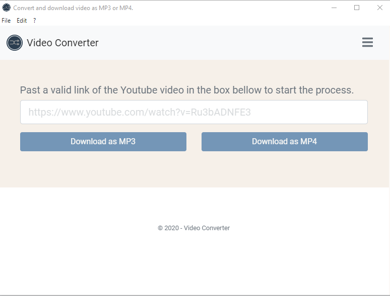

<p align="center">
  <a href="https://github.com/Youssef-ben"></a>
</p>

# Online video converter

The idea of this project came from the fact that most of the free tools that exist on the internet have some restrictions like the length of the video, must watch ads, or a confusion UI with a lot of download buttons. With this, the need to create a free tool that has none of the inconvenience or restrictions like the others became stronger.

The **Online video converter** is a web/desktop application that will allows you to download youtube videos as `MP4s` or convert them to `MP3s` without any restriction.

## Disclaimer

This application should be used for **non-copyrighted** and open-source videos only and should be for personal use only.

If you wish to use any copyrighted videos from Youtube you must obtain expressed permission from the copyright owner.

## Stack

- [Create React App](https://create-react-app.dev/docs/getting-started/): Create React App is an officially supported way to create single-page React applications. It offers a modern build setup with no configuration.
- [ReactJS](https://fr.reactjs.org/): JavaScript library for creating user interfaces.
- [Electron](https://www.electronjs.org/): Develop cross-platform desktop applications with JavaScript, HTML and CSS
- [Sass](https://sass-lang.com/): Sass is a stylesheet language that’s compiled to CSS.
- [FFmpeg](https://www.ffmpeg.org/): A complete, cross-platform solution to record, convert and stream audio and video.

## Dependencies

- [Electron](https://www.npmjs.com/package/electron).
- [ytdl-core](https://www.npmjs.com/package/ytdl-core).
- [fluent-ffmpeg](https://www.npmjs.com/package/fluent-ffmpeg).
- [ffmpeg-static](https://www.npmjs.com/package/ffmpeg-static).
- [react-bootstrap](https://www.npmjs.com/package/react-bootstrap).

## Future Improvements

- [ ] Allow users to browse files to convert.
- [ ] Make the app as a web page.
- [ ] Add multiple videos to download.

## Getting started

To start developing or using the application you need to make sure that you have [NodeJs v12.16.x](https://nodejs.org/dist/latest-v12.x/node-v12.16.2-x64.msi) and the package manager [yarn v1.22.x](https://classic.yarnpkg.com/en/docs/install#windows-stable) installed.

### Useful commands

```bash

## Install dependencies
yarn

## Run the application
yarn run-dev

or

yarn start
yarn run-electron

## Build the application
yarn build

## Package the application
yarn pack-win-electron or make pack-win

## Lint the project
yarn lint-fix

## Clean the project
make clean
```

## Preview


