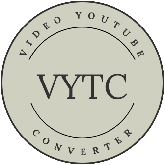
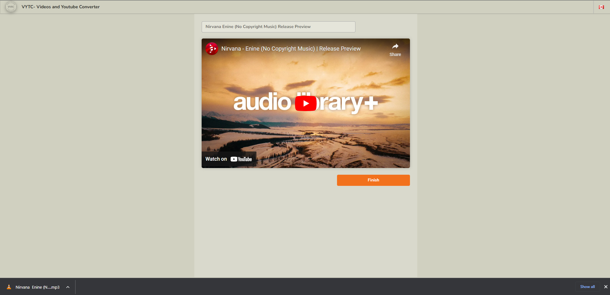

# Videos and youtube converter

<p align="center">
  <a href="https://github.com/Youssef-ben/video-converter">
    
  </a>
</p>


## Purpose

The idea of this project came from the fact that most of the free tools that exist
on the internet have some restrictions like the length of the video, must watch ads,
or a confusion UI with a lot of download buttons. With this, the need to create a
free tool that has none of the inconvenience or restrictions like the others became
stronger.

The **Videos and youtube converter** is a web/server application that will allows
you to download youtube videos as `MP4s` or convert them to `MP3s` without any restriction.

## Disclaimer

This application should be used for **non-copyrighted** and open-source videos only
and should be for personal use only.

If you wish to use any copyrighted videos from Youtube you must obtain expressed
permission from the copyright owner.

## Future Improvements

- [ ] Make a desktop app using electron.
- [ ] Add multiple videos to be downloaded.
- [ ] Allow users to browse files to convert.

## Project structure

```mk
video-converter
|  +-- src/                         # vytc source code projects
|  |  +-- Clients/                  # vytc client apps.
|  |      +-- common                # vytc common library used by the web and mobile.
|  |      +-- mobile                # vytc mobile app using React Native
|  |      +-- web                   # vytc web app using React
|  |  +-- Server/                   # vytc Server REST API.
|
|  +-- docker/
|  |  +-- docker-compose.yml
|  |  +-- Dockerfile
|
|  +-- docs/
|  |  +-- Architectural_design/
|  |  +-- getting-started.md
|
|  +-- Assets/
|  |  +-- Images/
|  |  +-- Postman/
```

## Stack

### Server stack

- NodeJS 16+
- Express
- TypeScript
- Mocha
- Swagger
- Tsoa
- ytdl-core
- fluent-ffmpeg
- ffmpeg-static
- Socket.io.server

### Clients stack

- ReactJS
- React Native (Expo)
- TypeScript
- Semantic UI
- React router
- Socket.io.client
- I18Next

## Getting Started

Once you've cloned the project make the following changes:

- Create a `.env` file for all the projects based on `.env.example` file for each project.

```bash
make generate-env
```

- Create a configuration file for the Server project `./src/server/src/config/config.<env>.json`
  to override the default configuration to your liking.

### Docker

Note:

- You need to have Gnu Make installed.
- The default Server port is: `3000`
- The default Client port is: `3001`

```bash
# Builds the Server and Client images.
make build-images

# Start the Server and Client containers.
make start

# Stop the Server and Client containers.
make stop

# Remove the Server and Client containers
make remove

# Stops and remove the Server and Client container and delete the images.
make clean
```

### Yarn

Running the project in debug mode.

#### Server

##### Open a new instance of the Server vsCode editor

```bash
make open-server
```

##### Start Server

Use the following commands to start the `Server`:

```bash
# Install the dependencies.
yarn

# Start the server.
yarn start
```

#### Client

##### Open a new instance of the Client vsCode editor

```bash
make open-client
```

##### Start Client

Use the following commands to start the `Client`:

```bash
# Install the dependencies.
yarn

# Start the client.
yarn start
```

## Preview



